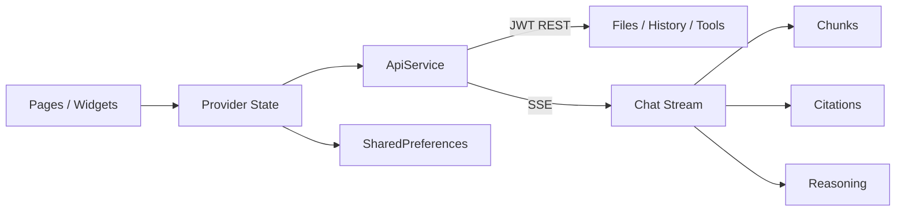

# 知天 Windows 客户端

[](https://github.com/z987645344-arch/zhitian_app/actions/workflows/ci.yml)


知天 Windows 客户端是 [知天 Agent Platform](https://github.com/z987645344-arch/zhitian) 的主要用户界面。它不是简单的聊天壳：知识库引用、附件阅读、文件生成与转换、个人文件库、历史会话和 fast/expert 能力分层都已经形成可操作的桌面工作台。

## 产品体验

- **三栏工作台**：左侧会话与全局导航，中间专注对话，右侧展示模式和工具状态；窄窗口自动收缩。
- **快速 / 专家模式**：fast 面向日常上下文与知识库问答；expert 开启联网搜索、任务分解、文件生成/转换和决策理由。
- **可验证回答**：流式输出支持 citations，助手消息可展开查看引用来源；expert 展示本轮路由理由。
- **聊天附件**：支持多文件选择、上传状态、纯附件发送和历史附件 chip 回显。
- **统一个人文件库**：生成文件、转换产物和原始附件集中列表，可下载、删除和预览 TXT/MD/PDF/DOCX。
- **独立工具箱**：六向 Office/PDF 转换、PDF 合并与逐页拆分，支持拖放和增量选择。
- **会话管理**：历史会话跨重启恢复，支持重命名、删除和继续对话。

## 两种模式

| 能力 | 快速 | 专家 |
|---|:---:|:---:|
| 上下文对话 | ✓ | ✓ |
| 企业知识库检索 | ✓ | ✓ |
| 聊天附件阅读 | ✓ | ✓ |
| 联网搜索 |  | ✓ |
| 复杂任务分解 |  | ✓ |
| 文件生成（MD/TXT/PDF/DOCX） |  | ✓ |
| 对话内附件转换 |  | ✓ |
| 决策理由展示 |  | ✓ |

fast 路径最多进行两次模型调用，能力边界由后端工具集合保证，而不是仅在界面上隐藏入口。

## 客户端架构



| 目录 | 职责 |
|---|---|
| `lib/pages/` | 聊天、历史、工具箱、文件库、预览、登录和设置页面 |
| `lib/providers/` | 会话、消息、模式和附件上传状态 |
| `lib/services/` | JWT API、multipart、SSE 解析和错误分类 |
| `lib/models/` | 消息、引用、会话、附件、文件与转换结果模型 |
| `lib/theme/` | Bronze Intelligence 视觉令牌与全局主题 |
| `test/` | API 序列化、Provider 状态和关键 Widget 交互测试 |

## 快速运行

### 前置条件

- Windows 10/11
- Flutter Stable 与 Dart SDK
- Visual Studio 的 **Desktop development with C++** 工作负载
- 已运行的 [知天后端](https://github.com/z987645344-arch/zhitian)

```powershell
git clone https://github.com/z987645344-arch/zhitian_app.git
cd zhitian_app
flutter pub get
flutter run -d windows
```

首次启动后，在设置页确认后端地址；默认是 `http://localhost:8000`。

## 推荐评审路径

1. 登录后分别切换 fast/expert，观察模式说明和响应差异。
2. 上传 TXT/PDF 附件，不输入文字直接发送，确认附件 chip 与内容理解。
3. 对企业知识提问，展开助手消息中的引用来源。
4. 要求 expert 生成 DOCX/PDF，然后在“我的文件”中预览或下载。
5. 在工具箱追加选择多个 PDF，调整列表后执行合并。
6. 新建、重命名、删除会话，并重启应用确认历史恢复。

## 质量证据

- `flutter analyze`：无问题。
- 客户端自动化测试：**27 tests passed**。
- Windows Release 构建已验证。
- GitHub Actions 在每次 push/PR 执行 `flutter pub get`、`flutter analyze` 和 `flutter test`。

## 已知边界

- 当前目标平台是 Windows Desktop，不维护 Android/iOS 构建。
- 聊天附件文本上下文默认在后端内存保留 30 分钟；原始文件进入个人文件库并持续保存至用户删除。
- Markdown 预览当前按纯文本展示，尚未引入 Markdown 渲染依赖。
- PDF 转 Office 为尽力重建，不承诺扫描件 OCR 或复杂版式无损恢复。

## 关联仓库

- [zhitian](https://github.com/z987645344-arch/zhitian)：后端与 Agent 核心
- [zhitian_admin](https://github.com/z987645344-arch/zhitian_admin)：员工/审核员管理后台

## License

当前仓库未附带开源许可证，默认保留全部权利。
